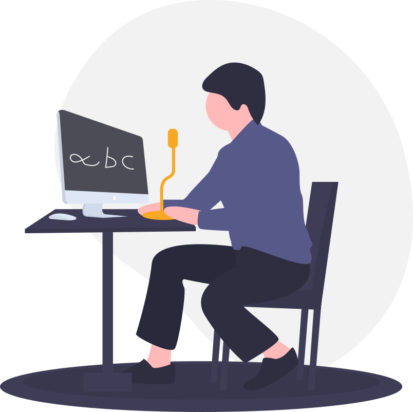
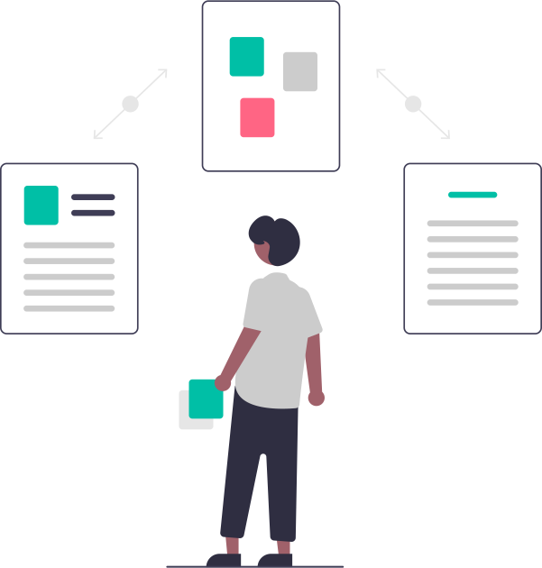
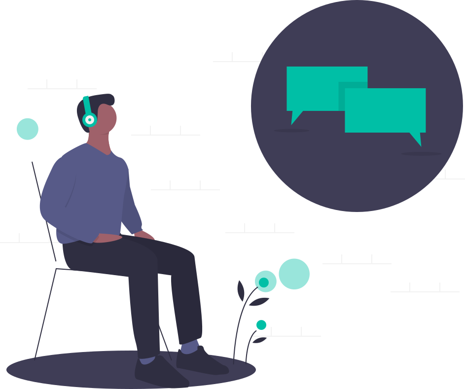

O meu projeto de PAP consiste na **criação de um assistente pessoal** (semelhante a Google Assistant &reg; e Amazon Alexa &reg;), mas mais simples e fácil de utilizar. O projeto é *Open Source* e o código fonte encontra-se disponível para consulta em [https://github.com/pyVoice/pyVoice](https://github.com/pyVoice/pyVoice).

Para o desenvolvimento do projeto será utilizada a linguagem de programação [Python](https://www.python.org/), devido à sua facilidade de aprendizagem e à minha experiência pessoal com esta linguagem.

## Inspiração

Este projeto surgiu devido ao meu interesse por est e manipulação de voz/áudio.

## Visão Geral

O projeto engloba três áreas, que ao funcionarem em conjunto, permitem o funcionamento da aplicação.

Seguem-se as áreas que o projeto envolve.

### Reconhecimento de voz

Responsável por converter a voz do utilizador (obtida através do microfone do dispositivo) para texto, que o computador consegue processar.

### *Matching* de *input* com comandos

Após o áudio ter sido reconhecido e convertido para texto, será comparado com padrões de comandos pré-definidos, decidindo assim a melhor resposta.

### Conversão de texto para voz

A resposta, ao pedido do utilizador, será convertida para voz e reproduzida no dispositivo, permitindo assim que o utilizador nem perca tempo a ler a resposta!

## Materiais, Utilitários e Plataformas

### Materiais

Para o desenvolvimento deste projeto, irei utilizar o meu **computador pessoal** (para a maioria das tarefas) e **equipamento de captura de áudio e vídeo** (para a criação do *spot* publicitário e outros materiais).

### Utilitários

Em relação a utilitários, irei utilizar os seguintes (sujeitos a mudanças com o decorrer do projeto) para o desenvolvimento do projeto:

#### Programação/Desenvolvimento

- **Visual Studio Code** (editor de código)
- **Git** (controlo de versões)

#### Produção de Conteúdo

- **Adobe Photoshop** (edição de imagem e criação de conteúdo digital)
- **Adobe Illustrator** (logótipos e edição de imagem vetorial)
- **LucidChart** (diagramas e esquemas)
- **Slides** (apresentações multimédia do projeto)

### Plataformas

As plataformas que utilizei e ainda utilizo no ecossistema do projeto.

- **Github** (repositório, *CI/CD*, *issue tracking*)
- **Microsoft Azure** (plataforma *cloud*: máquinas virtuais, alojamento de ficheiros)
- **MongoDB Atlas** (plataforma *cloud*: alojamento da base de dados da *API*)
- **Confluence** (documentação e *wiki* interna)
- **Sentry** (recolha de erros e *bugs*)
- **Datadog** (recolha de métricas e alertas de infraestrutura)

## Disciplinas Envolvidas

As seguintes disciplinas forneceram apoio e ajudaram no desenvolvimento do projeto durante o período escolar.

- **Português** (revisão ortográfica e gramatical dos materiais do projeto)
- **Inglês** (tradução dos materiais e conteúdo do projeto)
- **Sistemas de Informação** (desenvolvimento do projeto, desenho e criação da base de dados da *API*)
- **Desenvolvimento Web** (desenvolvimento do *website* do projeto)

Devo agradecer a todos professores, que sempre ajudaram na realização do projeto e que o tornaram possível, através do seu conhecimento e disponibilidade para ajudar.